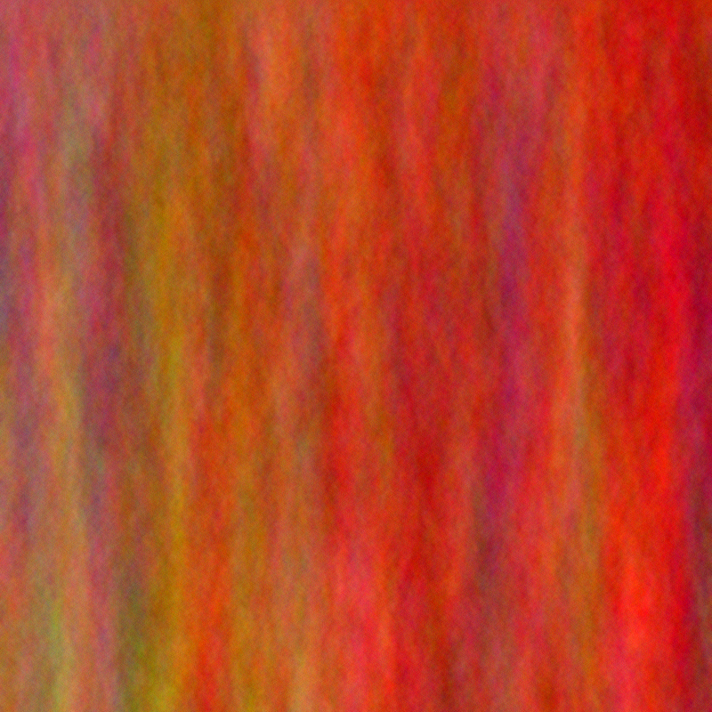
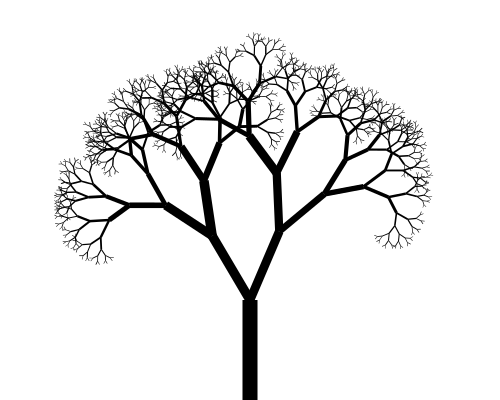
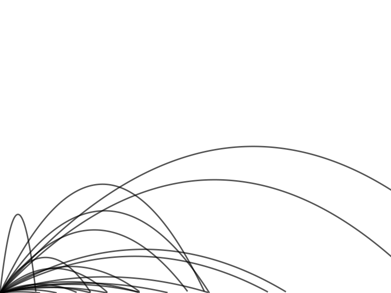
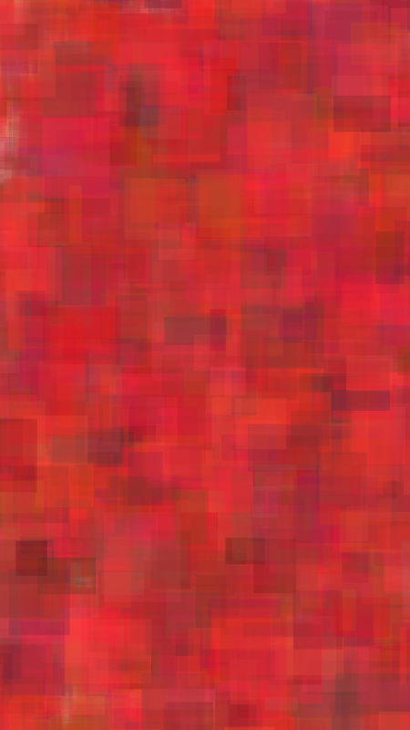
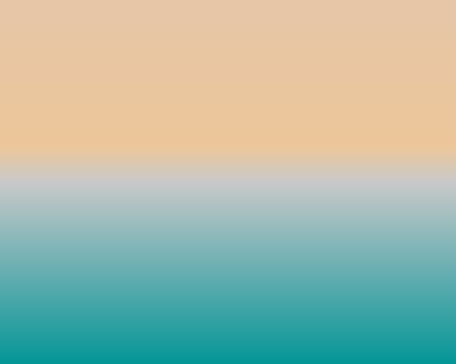
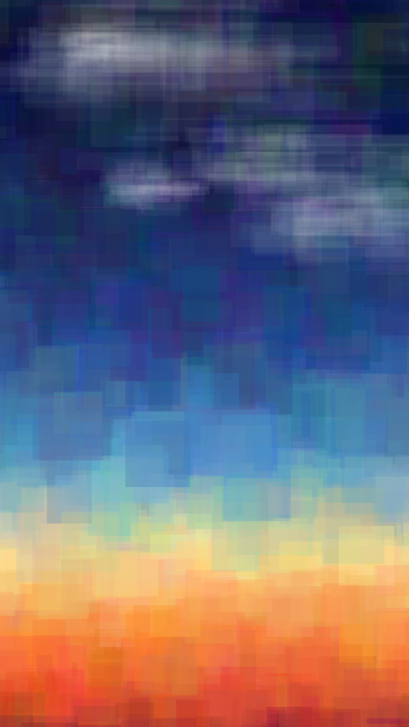

# Algorithmic Art

Examples of how to create pictures with code.

## How to run

All examples are self-contained. Open the folder, install the dependencies with

```
npm install
```

and run the code with

```
tsx main.ts
```

## Examples

(In roughly the order you should go through them).

### board


### animatedboard

### drip



### tree



### projectiles




### transparent-squares



### gradients




### transparent-squares-gradient


### clouds


